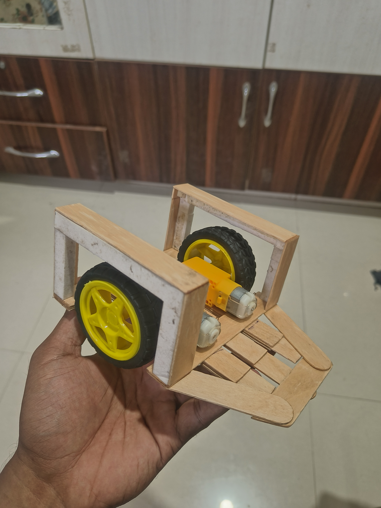
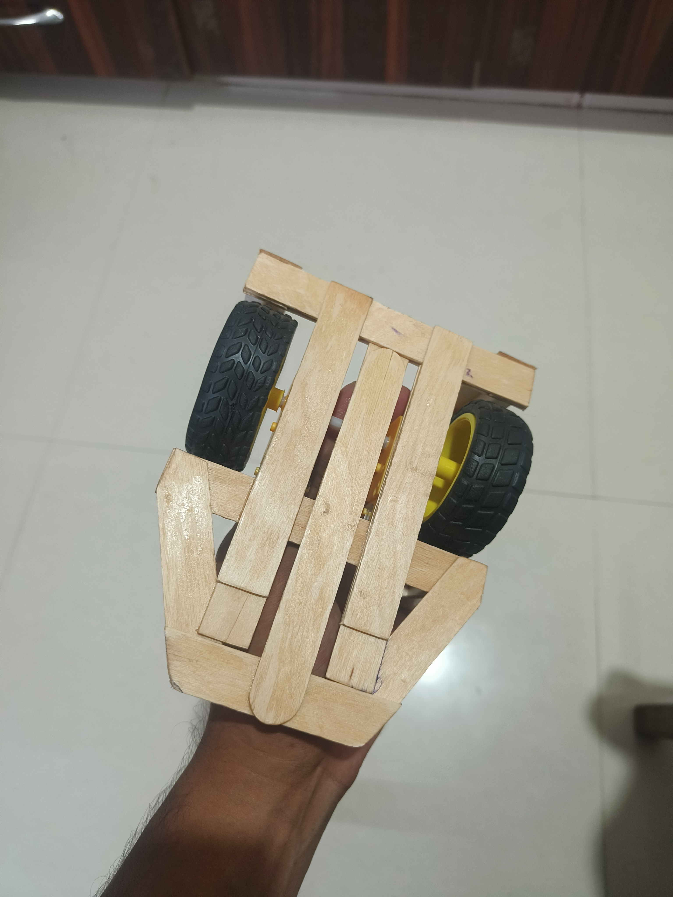
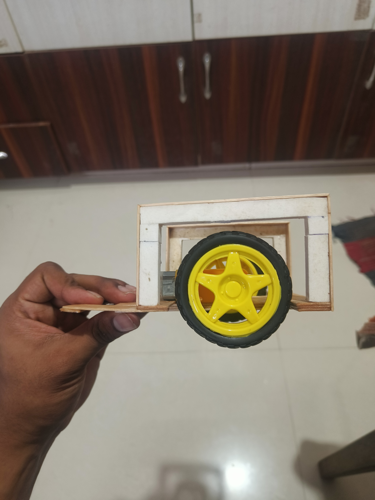
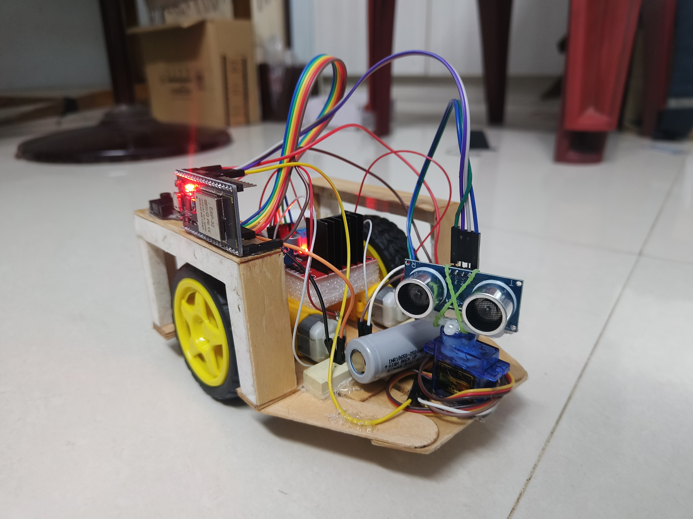
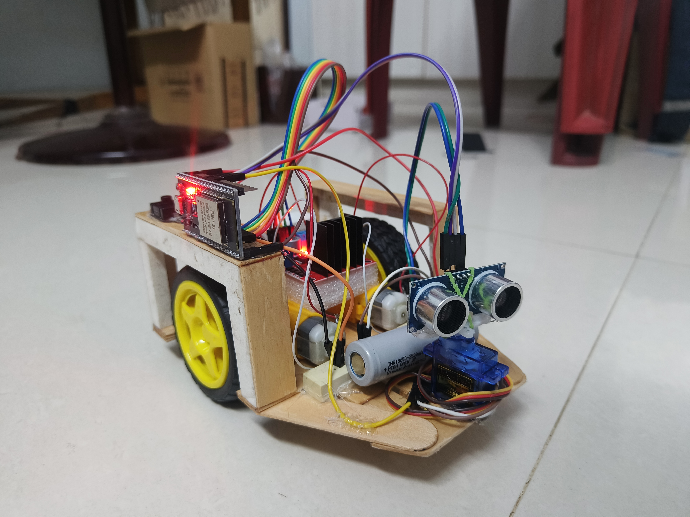
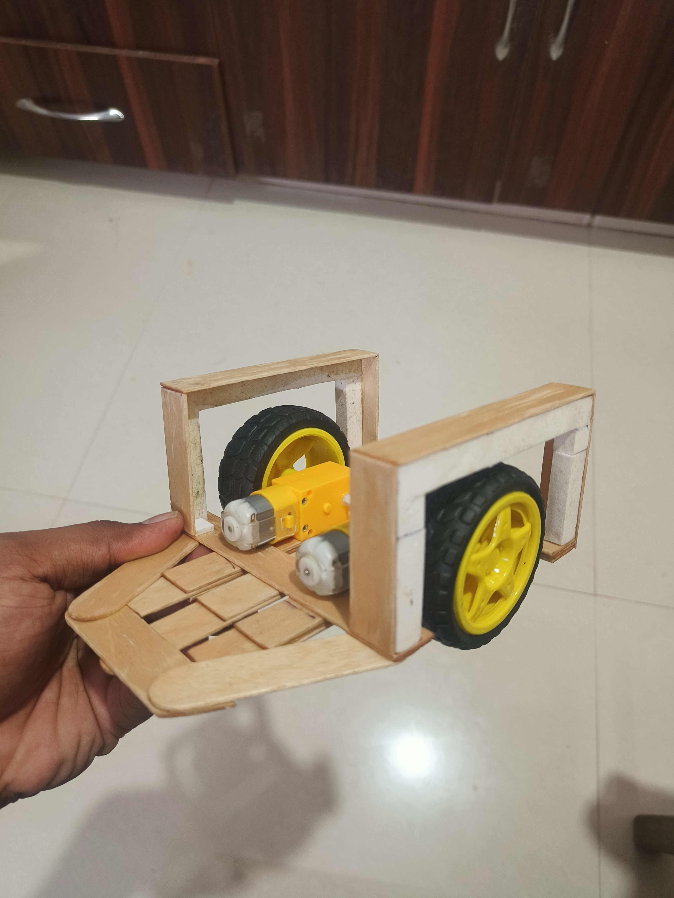
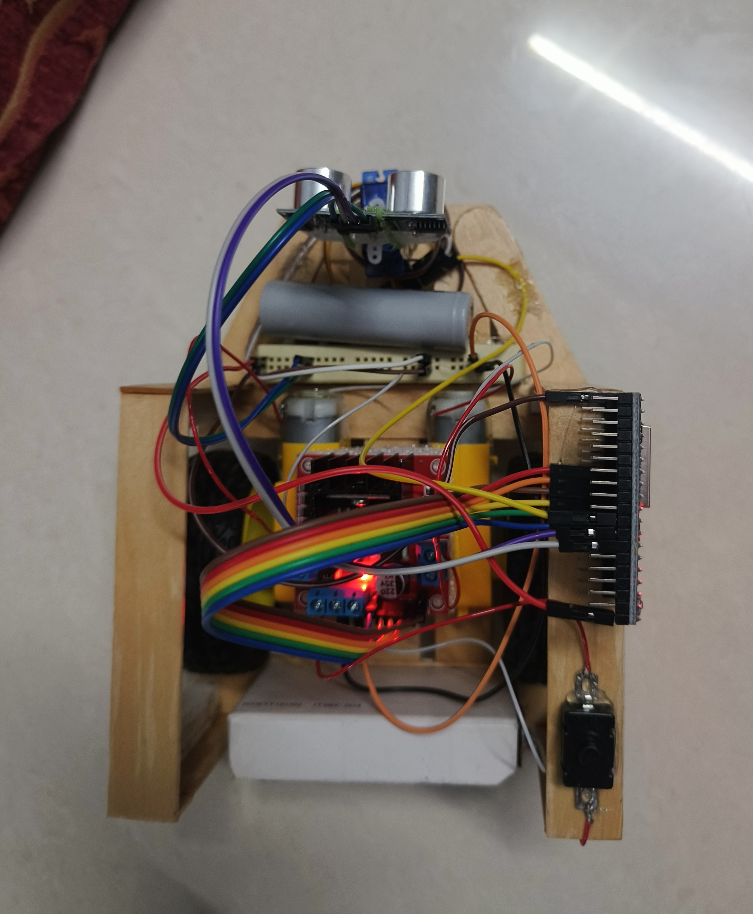
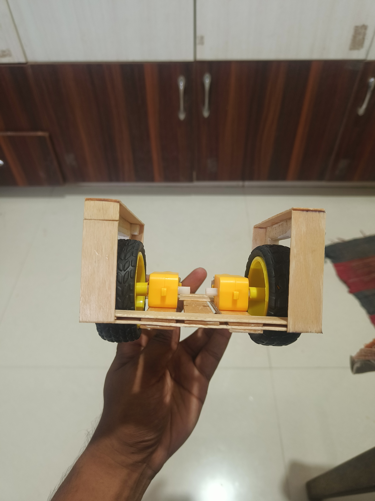
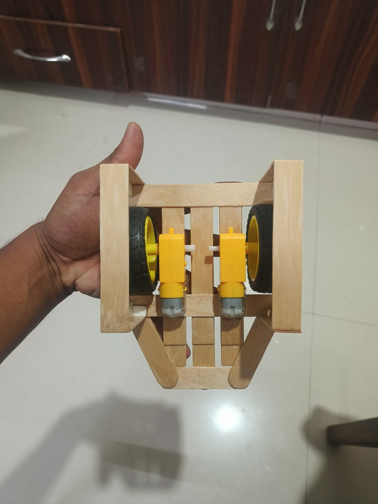

# ESP32 Object Avoidance Robot 🤖

An autonomous object-avoidance robot powered by an **ESP32**. This robot uses an **HC-SR04 ultrasonic sensor mounted on an SG90 servo motor** to scan its surroundings, detect obstacles, and navigate around them by choosing the clearest path.

## 📸 Project Build

### 🏗️ Custom Robot Chassis



The robot chassis was manually designed and built using lightweight wooden/ice-cream sticks. The frame provides support for the motors, wheels, electronics, battery, and ultrasonic sensor assembly.

---

### ⚙️ Motor and Wheel Assembly



The bottom view shows the **DC geared motors and wheel arrangement**. The two motors provide differential drive, allowing the robot to move forward, backward, and turn left or right.

---

### 🔧 Side Structure



The side view shows the custom-built frame supporting the wheels and internal components. The structure was designed to keep the robot lightweight while providing sufficient mechanical strength.

---

### 🔌 Electronics and Wiring



The robot integrates the **ESP32 development board, L298N motor driver, battery supply, servo motor, and HC-SR04 ultrasonic sensor**. Jumper wires connect the different modules to the ESP32.

---

### 📡 Ultrasonic Sensor System



The **HC-SR04 ultrasonic sensor** is mounted at the front of the robot using an **SG90 servo motor**. The servo allows the sensor to rotate and scan different directions for obstacle detection.

---

### 🔋 Internal Component Arrangement



This view shows the internal arrangement of the motors, wiring, battery, motor driver, and other electronic components inside the custom chassis.

---

### 🔝 Top View



The top view shows the overall layout of the robot, including the sensor assembly, electronics, power source, and mechanical structure.

---

### 🔙 Rear View



The rear view shows the supporting structure and the arrangement of the drive system inside the robot chassis.

---

### 🛠️ Frame Top View



This view shows the top structure of the custom-built chassis and the mounting arrangement used for the robot's components.

---

## 🎥 See it in Action

Check out the full DIY build process, including detailed table recording footage of the assembly and testing, on **Kalyan Xperiments**:

[](YOUR_YOUTUBE_VIDEO_LINK_HERE)

---

## 🛠️ Components Used

* **Microcontroller:** ESP32 Development Board
* **Motor Driver:** L298N
* **Motors:** 2 × DC Gear Motors
* **Sensor:** HC-SR04 Ultrasonic Distance Sensor
* **Actuator:** SG90 Micro Servo Motor
* **Power:** Battery pack (e.g., 2 × 18650 Li-ion cells)
* **Chassis:** Custom-built wooden chassis
* **Wheels:** Robot wheels
* Jumper wires and connecting components

---

## 🔌 Circuit Connections (Pin Mapping)

| Component           | ESP32 Pin |
| :------------------ | :-------- |
| **Ultrasonic TRIG** | GPIO 5    |
| **Ultrasonic ECHO** | GPIO 18   |
| **Motor IN1**       | GPIO 27   |
| **Motor IN2**       | GPIO 26   |
| **Motor IN3**       | GPIO 25   |
| **Motor IN4**       | GPIO 33   |
| **Servo Signal**    | GPIO 13   |

---

## 🚀 How It Works

### 1. Forward Motion

The robot moves forward as long as the path ahead is clear with a measured distance greater than **20 cm**.

### 2. Obstacle Detection

If an obstacle is detected within **20 cm**, the robot stops to avoid a collision.

### 3. Scanning

The servo motor rotates the ultrasonic sensor to the **left (150°)** and **right (30°)** to measure the available distance.

### 4. Decision Making

The ESP32 compares the left and right distances and determines which direction has more available space.

### 5. Autonomous Navigation

The robot turns toward the side with the clearest path and then resumes forward motion.

---

## 💻 Installation & Setup

1. Clone this repository or download the source code.
2. Open the `.ino` file from the **Code** folder in Arduino IDE.
3. Ensure you have the **ESP32 board package** installed in Boards Manager.
4. If you experience compilation issues with the standard `Servo.h` library on the ESP32, install the **ESP32Servo** library from the Library Manager.
5. Change:

```cpp
#include <Servo.h>
```

to:

```cpp
#include <ESP32Servo.h>
```

6. Connect your ESP32.
7. Select the correct ESP32 board and COM port.
8. Click **Upload**.
9. Power the robot and test the obstacle-avoidance system.

---

## 📁 Project Structure

```text
ESP32-Object-Avoidance-Robot/
│
├── Code/
│   └── Obstacle_Avoiding_Robot.ino
│
├── Images/
│   ├── Frame-Back-View-IMG.jpg
│   ├── Frame-Bottom-View-IMG.jpg
│   ├── Frame-IMG.jpg
│   ├── Frame-IMG2.jpg
│   ├── Frame-Side-View-IMG.jpg
│   ├── Frame-Top-View-IMG.jpg
│   ├── Robot-Top-View-IMG.jpg
│   ├── Robot-View-IMG.jpg
│   └── Robot-View2-IMG.jpg
│
└── README.md
```

---

## 🤝 Contributing

Feel free to fork this project, submit pull requests, or send suggestions to improve the navigation logic.

---

## ⭐ Project Highlights

* 🤖 ESP32-based autonomous robot
* 📡 Ultrasonic obstacle detection
* 🔄 Servo-controlled sensor scanning
* 🧭 Automatic path selection
* ⚙️ Dual DC motor drive
* 🔋 Battery-powered system
* 🛠️ Custom-built chassis
* 💻 Embedded C/C++ programming
* 🚗 Autonomous obstacle avoidance
